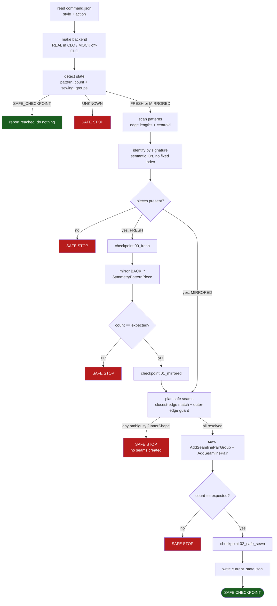
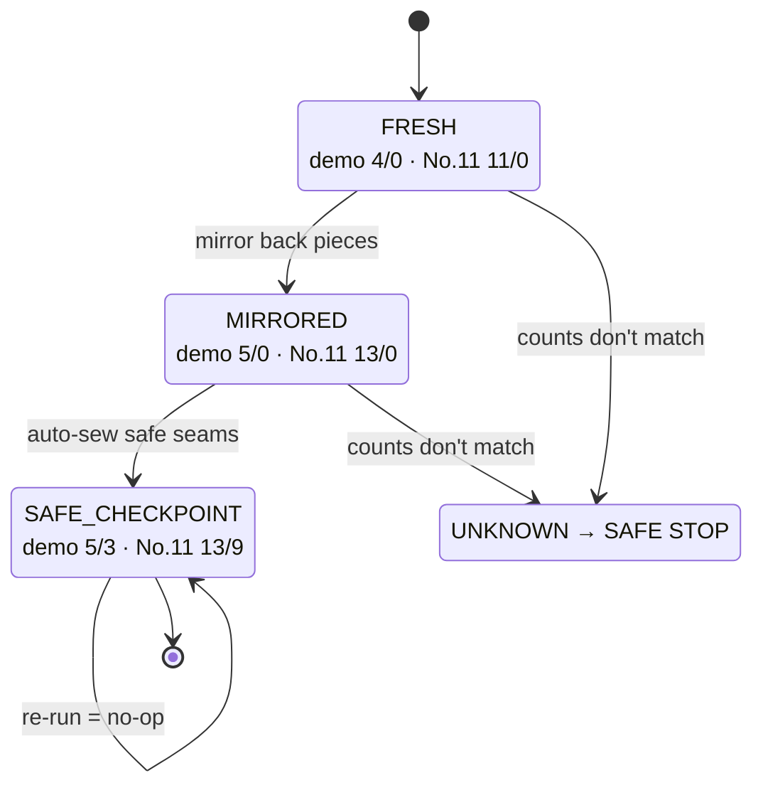
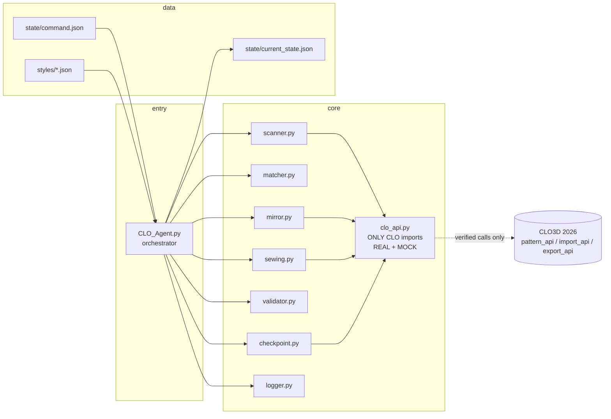
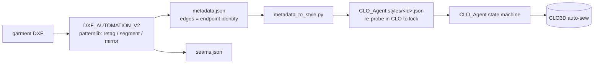
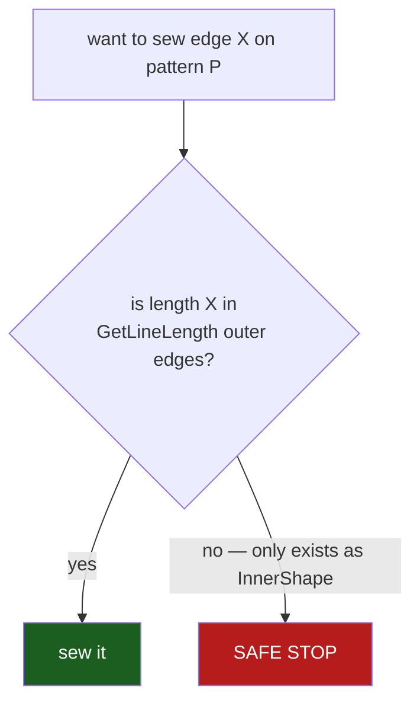

# Architecture & flow

Diagrams render natively on GitHub (Mermaid). All examples use the synthetic `demo` style.

## 1. What CLO_Agent does in one run (v0.1)

## 2. State machine

The agent only ever moves forward one verified stage; any unexpected state is a hard stop.

v0.2+ will extend the chain: `SAFE_CHECKPOINT → ARRANGED → SIMULATED → EXPORTED`.

## 3. Module architecture

Only `clo_api.py` touches CLO. Everything else is pure Python and testable off‑CLO (`selftest.py`).

## 4. How the two tools connect

## 5. The InnerShape guard (why the yoke is excluded)

`GetLineLength` returns the **outer** boundary only. A CLO "Uniform Split" shows halves in the UI but
the API's outer edge is unchanged — the halves live in InnerShape. The agent can only sew what
`GetLineLength` reports, so it can never sew to an InnerShape edge; a missing expected outer edge is a
hard stop. This is the operationalised lesson from the failed yoke attempt.
